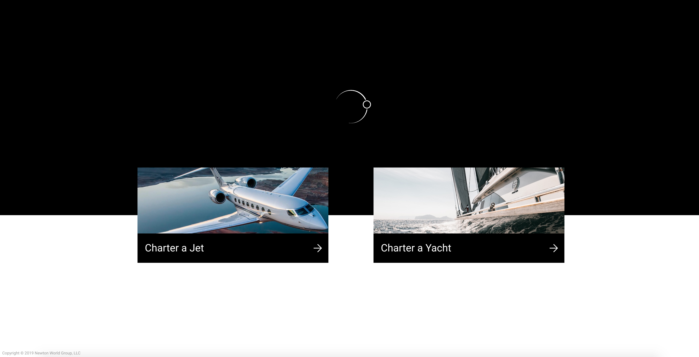

# Project Name

> Here goes your project description!

## Table of contents
* [General info](#general-info)
* [Status](#status)
* [Screenshots](#screenshots)
* [Technologies](#technologies)
* [Setup](#setup)
* [Code examples](#code-examles)
* [Running the tests](#running-the-tests)
* [Deployment](#deployment)
* [Contributing](#contributing)
* [Versioning](#versioning)
* [License](#license)
* [Features](#features)
* [Authors](#authors)
* [Contact](#contact)

## General info
Add more general information about project. What the purpose of the project is?

## Status
Project is: _in progress_, _finished_, _no longer continue_ and why?

To-do list:
* Wow improvement to be done 1
* Wow improvement to be done 2

## Screenshots


## Technologies
* Tech 1 - version 1.0
* Tech 2 - version 2.0
* Tech 3 - version 3.0

## Setup
Describe how to install / setup your local environment / add link to demo version.

### Prerequisites

What things you need to install the software and how to install them

```
Give examples
```

### Installing

A step by step series of examples that tell you how to get a development env running

Say what the step will be

```
Give the example
```

And repeat

```
until finished
```

End with an example of getting some data out of the system or using it for a little demo

## Code Examples
Show examples of usage:
`put-your-code-here`

## Running the tests

Explain how to run the automated tests for this system

### Break down into end to end tests

Explain what these tests test and why

```
Give an example
```

### And coding style tests

Explain what these tests test and why

```
Give an example
```
## Deployment

Add additional notes about how to deploy this on a live system

## Contributing

Please read [CONTRIBUTING.md] for details on our code of conduct, and the process for submitting pull requests to us.

## Versioning

For the versions available, see the [tags on this repository](https://github.com/your/project/tags). 

## License

This project is licensed under the MIT License - see the [LICENSE.md](LICENSE.md) file for details

## Features
List of features ready and TODOs for future development
* Awesome feature 1
* Awesome feature 2
* Awesome featured 3

## Authors

* **Roman Zhukovskii** - *Initial work* - [NewtonWorld](https://github.com/NewtonWorld)

See also the list of [contributors](https://github.com/your/project/contributors) who participated in this project.

## Contact
Created by [@r.zhukovskii](https://www.newtonworld.com/) - feel free to contact me!
